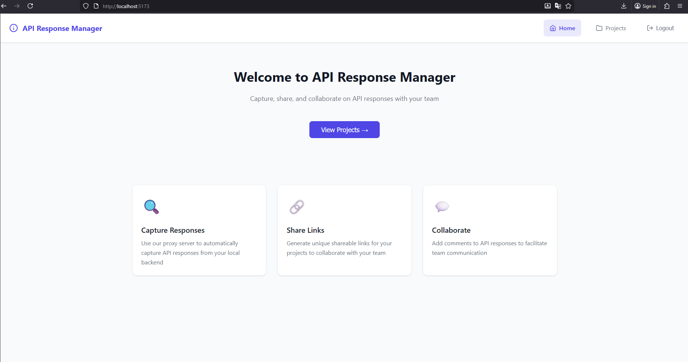
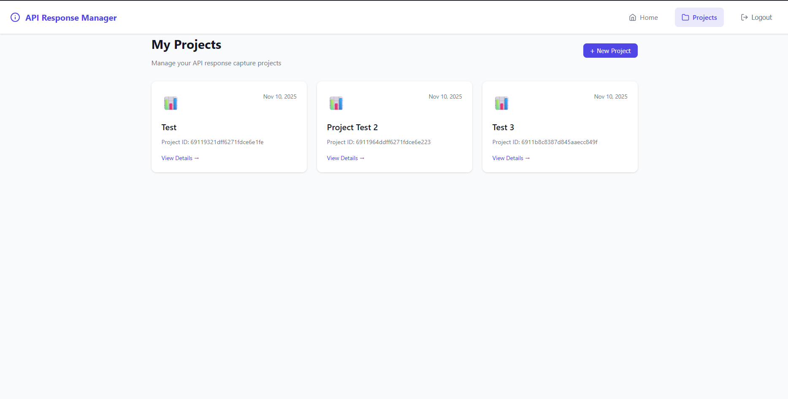
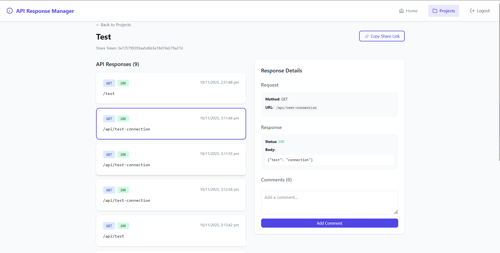

# API Response Manager

[](https://www.npmjs.com/package/@vijaypurohit322-arm/cli)
[](https://www.npmjs.com/package/api-response-manager)
[](https://opensource.org/licenses/MIT)

An interactive tool for developers to capture, share, and collaborate on API responses. Share your API testing results with team members using unique project links - no login required for viewers.

Demo SVG: <a>https://drive.google.com/uc?export=view&id=12eR09C2PcgCbvThRKtoSwpdEBfOa1eTb </a>




## ✨ Features

### Authentication & Security
- **🔐 User Authentication:** Secure JWT-based registration and login
- **🌐 Social Login:** Sign in with Google, GitHub, or Microsoft OAuth
- **🔄 Auto-redirect:** Automatic logout and redirect on session expiry

### Core Features
- **📊 Project Management:** Create and organize multiple projects
- **🎯 API Response Capturing:** Automatic capture via proxy server
- **🔗 Shareable Links:** Generate unique, public links for each project
- **💬 Collaboration:** Add comments to API responses for team discussions
- **⚡ Real-time Updates:** Automatic polling for new responses (every 10 seconds)

### Tunneling & Webhooks
- **🚇 Advanced Tunneling:** Expose local APIs with HTTPS/TLS, TCP, WebSocket support
  - Custom domains and SSL certificates
  - OAuth/OIDC/SAML authentication
  - Path-based routing (ingress)
  - Rate limiting and security features
- **🪝 Webhook Testing:** Advanced webhook debugging with signature validation, conditional routing, payload transformation, and integrations (Slack, Discord, Email)

### UI/UX
- **🎨 Modern UI:** Clean, responsive design with intuitive navigation
- **🌓 Dark/Light Theme:** Theme toggle with system auto-detect and persisted preference

## Tech Stack

- **Backend:** Node.js, Express, MongoDB
- **Frontend:** React, Vite
- **Proxy Server:** Node.js, http-proxy-middleware
- **Tunnel Server:** Node.js, WebSocket (ws), Express
- **Tunnel Client:** Node.js, WebSocket, Axios

## Getting Started

### Quick Install - CLI Tool

Install the ARM CLI globally:
```bash
npm install -g @arm/cli
```

Or use from source:
```bash
cd cli
npm install
npm link
```

See [cli/README.md](cli/README.md) for complete CLI documentation.

### Prerequisites

- Node.js (v14 or later)
- npm
- MongoDB

### Installation

1. **Clone the repository:**
   ```bash
   git clone https://github.com/your-username/api-response-manager.git
   cd api-response-manager
   ```

2. **Install backend dependencies:**
   ```bash
   npm install --prefix backend
   ```

3. **Install frontend dependencies:**
   ```bash
   npm install --prefix frontend
   ```

4. **Install proxy server dependencies:**
   ```bash
   npm install --prefix proxy
   ```

5. **Configure environment variables:**
   
   **Backend** - Copy `.env.example` to `.env` and configure:
   ```bash
   cp .env.example backend/.env
   ```
   
   Edit `backend/.env`:
   ```env
   MONGODB_URI=mongodb://localhost:27017/api-response-manager
   JWT_SECRET=your-super-secret-jwt-key-change-this
   
   # Optional: Social Login (see SOCIAL_AUTH_SETUP.md)
   GITHUB_CLIENT_ID=your-github-client-id
   GITHUB_CLIENT_SECRET=your-github-client-secret
   GOOGLE_CLIENT_ID=your-google-client-id
   GOOGLE_CLIENT_SECRET=your-google-client-secret
   ```
   
   **Frontend** - Create `frontend/.env`:
   ```env
   VITE_API_URL=http://localhost:5000/api
   
   # Optional: Social Login
   VITE_GITHUB_CLIENT_ID=your-github-client-id
   VITE_GOOGLE_CLIENT_ID=your-google-client-id
   ```

### Running the Application

1. **Start MongoDB:**
   - Make sure your MongoDB server is running.

2. **Start the backend server:**
   ```bash
   npm start --prefix backend
   ```
   The backend will be available at `http://localhost:5000`.

3. **Start the frontend server:**
   ```bash
   npm run dev --prefix frontend
   ```
   The frontend will be available at `http://localhost:5173`.

4. **Start the proxy server:**
   ```bash
   npm start --prefix proxy
   ```
   The proxy will be available at `http://localhost:8080`.

5. **Start the tunnel server (optional - for live tunneling):**
   ```bash
   npm install --prefix tunnel-server
   npm start --prefix tunnel-server
   ```
   The tunnel server will be available at `http://localhost:9000`.

### How to Use

#### Step 1: Register and Create a Project

1. **Register and Log In:**
   - Open your browser and navigate to `http://localhost:5173`
   - Click "Sign up" to create a new account
   - Login with your credentials

2. **Create a Project:**
   - Click on "Projects" in the navigation
   - Click "+ New Project" button
   - Enter a project name (e.g., "My API Testing")
   - Click "Create Project"
   - **Copy the Project ID** from the project detail page (shown under the project name)

#### Step 2: Connect Your Backend with the Proxy

3. **Configure the Proxy Server:**
   
   Open `proxy/server.js` and update these two values:

   ```javascript
   const target = 'http://localhost:3000'; // Change to YOUR backend URL
   const PROJECT_ID = 'your-project-id-here'; // Paste the Project ID you copied
   ```

   **Example Configuration:**
   ```javascript
   // If your backend runs on port 4000
   const target = 'http://localhost:4000';
   const PROJECT_ID = '674f8a2b1c9d4e0012345678';
   ```

4. **Start the Proxy Server:**
   ```bash
   npm start --prefix proxy
   ```
   The proxy will run on `http://localhost:8080`

#### Step 3: Capture API Responses

5. **Point Your API Calls to the Proxy:**

   Instead of calling your backend directly, route your requests through the proxy:

   **Before (Direct to Backend):**
   ```bash
   curl http://localhost:3000/api/users
   ```

   **After (Through Proxy):**
   ```bash
   curl http://localhost:8080/api/users
   ```

   **In Your Application Code:**
   
   ```javascript
   // JavaScript/React
   const API_BASE_URL = 'http://localhost:8080'; // Instead of your backend URL
   
   fetch(`${API_BASE_URL}/api/users`)
     .then(res => res.json())
     .then(data => console.log(data));
   ```

   ```python
   # Python
   import requests
   
   API_BASE_URL = 'http://localhost:8080'  # Instead of your backend URL
   response = requests.get(f'{API_BASE_URL}/api/users')
   print(response.json())
   ```

   **Using Postman:**
   - Change your request URL from `http://localhost:3000/api/users` to `http://localhost:8080/api/users`
   - Send your requests as normal
   - All responses will be automatically captured

6. **How It Works:**
   - The proxy forwards your request to your actual backend
   - Your backend processes the request normally
   - The proxy captures the response before sending it back to you
   - The captured response is stored in the API Response Manager
   - You get the response as if you called the backend directly
   - **Real-time Updates**: The project page automatically checks for new responses every 5 seconds
   - **Instant Notifications**: You'll see a notification when new responses are captured

#### Step 4: View and Share Responses

7. **View Captured Responses:**
   - Go to your project in the API Response Manager
   - View all captured API responses with details (request/response body, headers, status)

8. **Share with Your Team:**
   - Click "Copy Share Link" button in the project detail page
   - Share the link with anyone (no login required for them)
   - They can view all API responses and add comments

9. **Collaborate:**
   - Click on any API response to view details
   - Add comments to discuss specific responses
   - Team members can view and comment on shared projects

## Use Cases

### 1. **API Development & Testing**
```bash
# Test your API endpoints through the proxy
curl -X POST http://localhost:8080/api/login \
  -H "Content-Type: application/json" \
  -d '{"email":"test@example.com","password":"password123"}'

# All responses are automatically logged
```

### 2. **Live Tunneling (NEW!)**
```bash
# Expose your local API to the internet
# 1. Create tunnel via UI at http://localhost:5173/tunnels
# 2. Connect tunnel client:
cd tunnel-client
node client.js <tunnelId> <subdomain> 3000 <authToken> <userId>

# 3. Your local API is now public:
curl https://myapi.tunnel.arm.dev/api/users
```

### 3. **Bug Reporting**
- Capture the exact API response that caused a bug
- Share the link with your team
- Everyone can see the exact request/response that failed

### 4. **API Documentation**
- Capture real API responses as examples
- Share with frontend developers
- Show actual response structures

### 5. **Client Demos**
- Capture API responses during development
- Share with clients to show progress
- No need to give them access to your backend

### 6. **Webhook Testing & Development**
- Generate instant webhook URLs for testing
- Capture and inspect all incoming webhook requests
- Forward webhooks to local development servers or multiple destinations
- Validate webhook signatures (HMAC SHA-1/256/512)
- Edit and resend webhooks with modifications
- Apply conditional routing rules based on payload content
- Transform webhook payloads before forwarding
- Replay captured webhooks for debugging
- Get notifications via Slack, Discord, or Email
- View complete request history with filtering
- Test webhooks from GitHub, Stripe, Twilio, etc.

## Troubleshooting

**Q: My responses aren't being captured**
- Verify the proxy server is running on port 8080
- Check that PROJECT_ID in `proxy/server.js` matches your project ID
- Ensure you're sending requests to `http://localhost:8080` not your backend directly

**Q: Getting connection errors**
- Verify your backend is running
- Check the `target` URL in `proxy/server.js` matches your backend URL
- Make sure MongoDB is running for the API Response Manager backend

**Q: Proxy returns 500 error**
- Check the proxy server logs for errors
- Verify the API Response Manager backend is running on port 5000
- Ensure PROJECT_ID is a valid MongoDB ObjectId

**Q: Tunnel not connecting**
- Verify tunnel server is running on port 9000
- Check that local server is running on the specified port
- Ensure WebSocket connections are allowed through firewall
- Verify auth token and user ID are correct

**Q: Tunnel requests failing**
- Make sure test server/local API is running
- Check tunnel client shows "Tunnel Active!" message
- Verify subdomain matches in all commands
- Check tunnel server and backend logs for errors

**Q: Webhook not forwarding**
- Verify forwarding is enabled when creating webhook
- Check that tunnel is active if forwarding to tunnel
- Ensure local server is running on the specified port
- View webhook detail page to see forwarding errors

## Contributing

1. Fork the repository
2. Create a feature branch (`git checkout -b feature/amazing-feature`)
3. Commit your changes (`git commit -m 'Add amazing feature'`)
4. Push to the branch (`git push origin feature/amazing-feature`)
5. Open a Pull Request

## License

This project is licensed under the MIT License - see the LICENSE file for details.

## Acknowledgments

- Contributed by Google Jules

## Support

For issues, questions, or contributions, please open an issue on the GitHub repository.

---

**Version:** 2.3.0  <br>
**Last Updated:** November 24, 2025 <br>
**Author:** Vijay Singh Purohit <br>
**Email:** <a href="mailto:vijaypurohit322@gmail.com?">vijaypurohit322@gmail.com</a>

## 🎉 What's New in v2.3.0

### 🌐 Social Authentication (NEW!)
- **OAuth Login Support** - Sign in with Google, GitHub, or Microsoft
  * One-click authentication
  * Automatic account creation and linking
  * Secure JWT token generation
  * Profile pictures from social accounts
- **Setup Guides** - Complete documentation for each provider
  * [GitHub Login Setup](docs/GITHUB_LOGIN_SETUP.md)
  * [Social Auth Setup](docs/SOCIAL_AUTH_SETUP.md)
- **Enhanced Security** - Environment-based JWT secrets

### 🚇 Advanced Tunneling Features (NEW!)
- **Protocol Support** - HTTP, HTTPS, TCP, WebSocket (WS/WSS)
- **Custom Domains** - Use your own domain names
- **SSL/TLS Certificates** - Upload custom certificates
- **Enterprise Authentication** - OAuth, OIDC, SAML support
- **Ingress/Gateway** - Path-based routing to multiple backends
- **CLI Commands** - Complete tunnel management from command line
  * See [CLI README](cli/README.md) for details

### 🪝 Webhook Testing Suite (Phase 2.1 & 2.2 Complete!)

#### Phase 2.1 - Advanced Debugging & Testing
- **🔐 HMAC Signature Validation** - Verify webhook authenticity with SHA-1/256/512
  * Configurable algorithm, secret key, and header name
  * GitHub/Stripe webhook compatibility
  * Timing-safe signature comparison
- **✏️ Request Modification & Resend** - Edit and replay webhooks with changes
  * Modify headers, body, and HTTP method
  * Interactive modal editor with JSON validation
  * Track modified requests separately
- **🎯 Multiple Destination Forwarding** - Forward to unlimited destinations simultaneously
  * Support for both tunnels and URLs
  * Individual success/failure tracking per destination
  * Enable/disable destinations independently
- **🔀 Conditional Forwarding Rules** - Route webhooks based on content
  * Multiple operators: equals, contains, regex, startsWith, endsWith, exists, greaterThan, lessThan
  * Nested field path support (body.event, headers.x-custom)
  * Actions: forward, skip, or transform
  * Route to specific destinations based on conditions
- **🔄 Payload Transformation** - Transform webhook data before forwarding
  * Field-to-field mapping with transformations
  * Built-in transforms: uppercase, lowercase, trim, json, base64
  * JSON template support for complete restructuring
  * Add/remove fields dynamically

#### Phase 2.2 - Integration & Automation
- **💬 Slack Integration** - Real-time notifications to Slack channels
  * Rich message formatting with attachments
  * Configurable events (received, forwarded, failed)
  * Color-coded status indicators
- **🎮 Discord Integration** - Send notifications to Discord
  * Embed messages with color coding
  * Event filtering and timestamps
- **📧 Email Alerts** - Email notification support
  * Multiple recipient configuration
  * Event-based triggers
  * Ready for email service integration

#### Phase 2.0 - Core Features
- **Instant Webhook URLs** - Generate unique webhook endpoints instantly
- **Automatic Request Logging** - Capture all incoming webhook requests with full details
- **Webhook Forwarding** - Forward webhooks to local servers via tunnels or direct URLs
- **Request History** - View all webhook requests with filtering by status
- **Replay Functionality** - Resend captured webhooks for testing
- **Statistics Dashboard** - Track total requests, forwarded, failed, and success rate
- **Beautiful UI** - Professional modal design with sectioned layout
- **Flexible Configuration** - Enable/disable forwarding, set expiration, choose targets
- **Request Inspection** - View headers, body, and forwarding results in detail
- **Status Tracking** - Monitor received, forwarded, failed, and replayed requests

### 🚇 Live Tunneling Service (Phase 1 Complete!)
- **Expose Local APIs** - Public URLs for local development servers
- **Custom Subdomains** - Choose your own or auto-generate
- **WebSocket Tunneling** - Real-time bidirectional communication with auto-reconnect
- **Rate Limiting** - Configurable per tunnel (default 60 req/min)
- **Security Features** - IP whitelisting, Basic auth, Token auth
- **SSL/TLS Support** - Let's Encrypt integration with ssl-proxy.js
- **Statistics Tracking** - Request count, bandwidth, uptime monitoring
- **Complete UI** - Create, manage, and monitor tunnels from web interface
- **Tunnel Expiration** - Auto-close tunnels after specified time
- **Heartbeat Monitoring** - Keep-alive mechanism with auto-cleanup

### 🌓 Dark/Light Theme (v2.0.3)
- Full theme support across the app
- Theme toggle with sun/moon icons
- Auto-detect system preference
- Persists user choice via localStorage
- Mobile sidebar improvements
- Better contrast and accessibility

### 📚 Documentation
- Complete setup guide ([docs/SETUP_GUIDE.md](docs/SETUP_GUIDE.md))
- Social auth setup ([docs/SOCIAL_AUTH_SETUP.md](docs/SOCIAL_AUTH_SETUP.md))
- Tunnel setup guide ([docs/TUNNEL_SETUP.md](docs/TUNNEL_SETUP.md))
- All documentation in [docs/](docs/) folder
